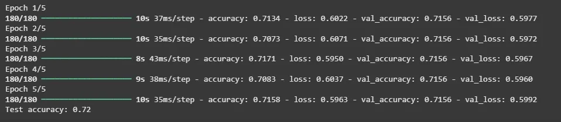
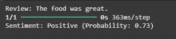

This project is a Sentiment Analysis system built using TensorFlow and Keras.
It uses text preprocessing, word embeddings, and a SimpleRNN model to classify
text reviews into positive or negative sentiments.
- Python
- Pandas, NumPy
- TensorFlow / Keras
- SimpleRNN
- NLP (Tokenization, Padding, Embedding)
- Binary Classification

